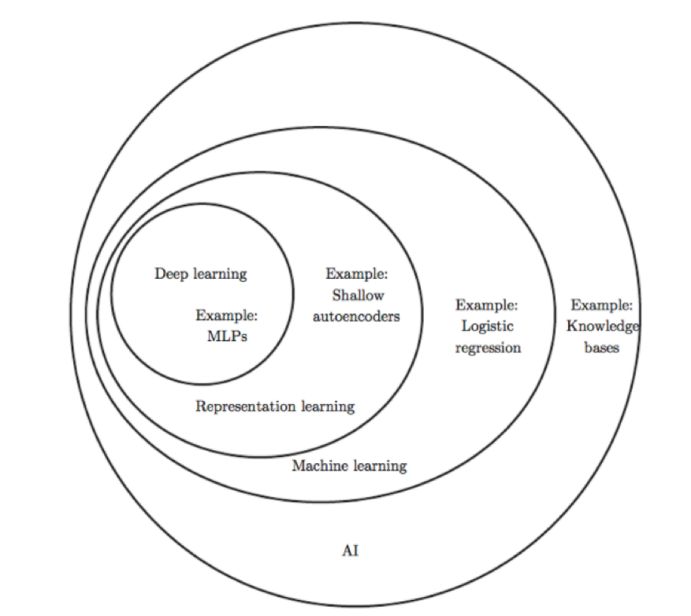
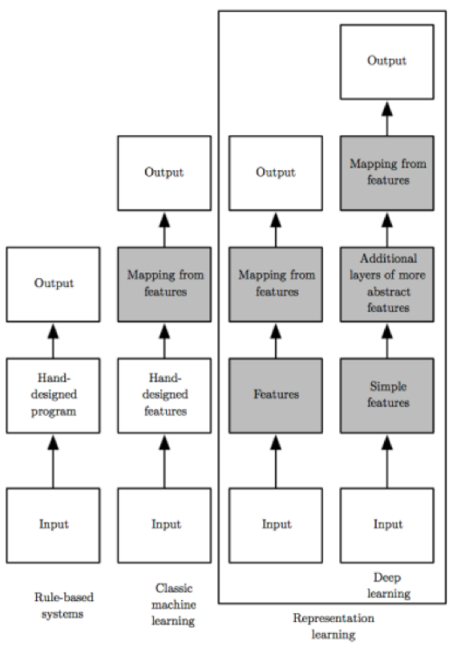
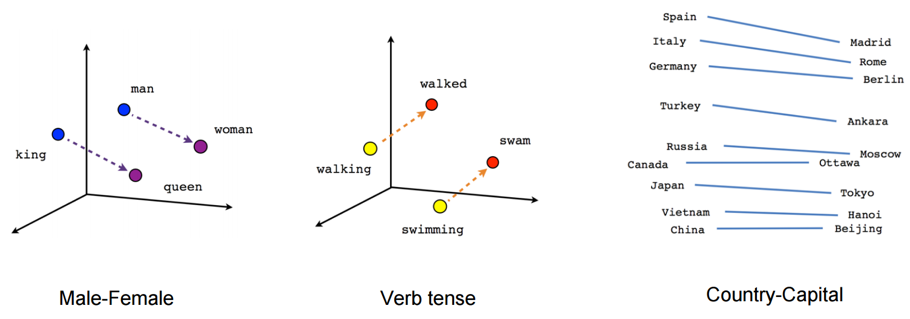
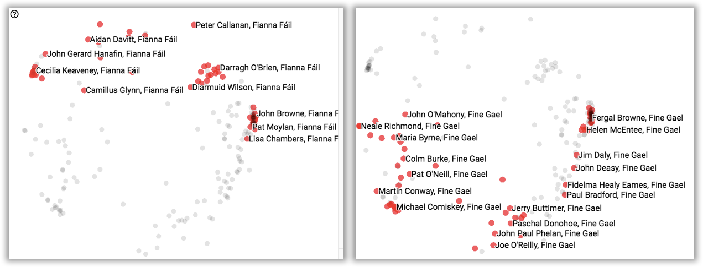

# Learning representations in Irish Politics

In Machine Learning, [Representation Learning][rl] is a set of techniques that allows a system to automatically discover the representations needed for feature detection or classification from raw data. This replaces manual feature engineering and allows a machine to both learn the features and use them to perform a specific task.

## Representational Learning

The following Venn diagram shows how deep learning is a kind of representation learning, which is in turn a kind of machine learning, which is used for many but not all approaches to AI. Each section of the Venn diagram includes an example of an AI technology. These figures are taken from [deeplearningbook.org][dlb]

<table>
    <tr>
        <td align="center">
Artificial Intelligence
</td>
        <td align="center">
Representational Learning
</td>
    </tr>
</table>

## Embeddings

On the other hand, computers are not able to understand text, text need to be converted into numbers! The most basic and naive method for transforming words into vectors is to count occurrence of each word in each document (one-hot encoding). Given a large vocabulary, like the English language, these vectors become very sparse representations and difficult to work with. This is the bag-of-words model. Instead, in an embedding, words are represented by dense vectors where a vector represents the projection of the word into a continuous vector space. Words or phrases from the vocabulary are mapped to vectors of real numbers. Conceptually it involves a mathematical embedding from a space with one dimension per word to a continuous vector space with a much lower dimension. In this continuous vector space, semantically similar words are mapped to nearby points (are embedded nearby each other). This uncovers powerful relationships like: male/female or country/capital

<table>
    <tr>
        <td align="center">
Word Embeddings
</td>
    </tr>
</table>

## Politics

In this repository, we leverage embeddings to learn representations of Irish senators and deputies. We create a prediction problem solved as a byproduct of these representations. Technically, a neural network is fed with votings for the bills being proposed and the network is able to learn and cluster politicians together based on the votings as the network contains an embeddings layer. We took inspiration from a US Congress analysis by Nathaniel Tucker that can be found [here][usa]

<table>
    <tr>
        <td align="center">
Word Embeddings
</td>
    </tr>
</table>

[rl]: https://en.wikipedia.org/wiki/Feature_learning
[dlb]: http://www.deeplearningbook.org/contents/intro.html
[usa]: https://github.com/knathanieltucker/tf-keras-tutorial/blob/master/SenatorRepresentations.ipynb
